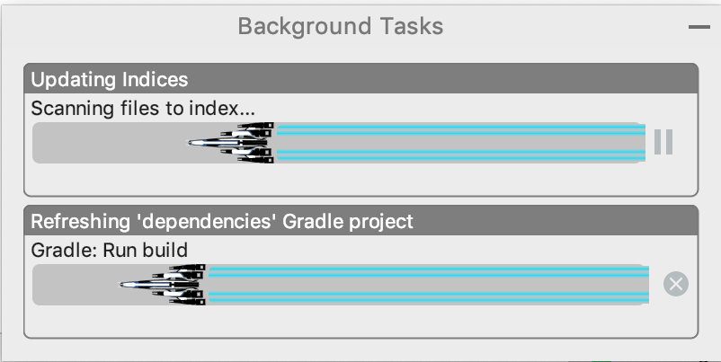

</img>

---

    <h2> I'm Commander Shepard and this is my favorite plugin.</h2>

---
Your progress bar becomes the SSV Normandy SR-1 traveling at FTL.

### Default Look

### [More images](assets/images.md)

Plugin page:
https://plugins.jetbrains.com/plugin/10804-doki-doki-literature-club-theme

## Plugin's that work with this plugin*

- [Doki-Doki Literature Club Theme](https://github.com/cyclic-reference/ddlc-jetbrains-theme)

*Auto theming integration only works in the Intellij IDE at the moment.

#### Contributions and fun ideas are encouraged!

Enjoy!
---
