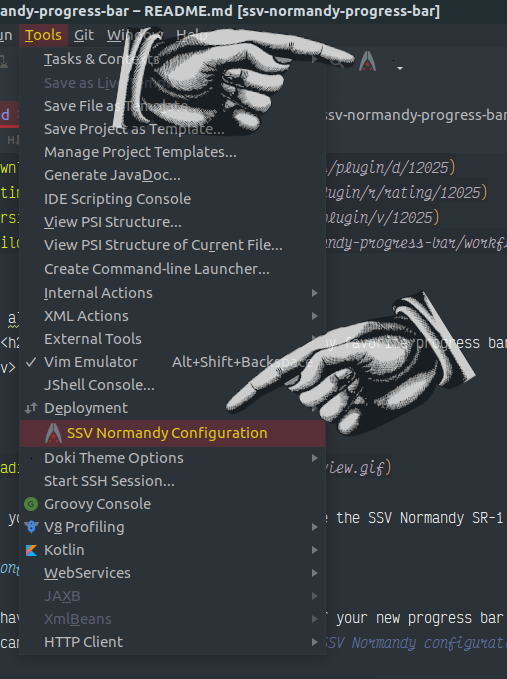

Normandy Progress Bar
---

---

    <h2> "I'm Commander Shepard and this is my favorite progress bar on the internet."</h2>

---

  </img>

Make your JetBrains IDE's progress bar become the SSV Normandy SR-1 traveling at faster than light speeds.

## Configuration

You have the ability to customize the look of your new progress bar.
You can find the settings menu via `Tools | SSV Normandy configuration` or the icon in the toolbar:

#### Customizations

---

## Plugin's that work with this plugin

The progress bar has the ability to pick of accents from these themes:

- [The Doki Theme](https://plugins.jetbrains.com/plugin/10804-the-doki-theme)
- [Material UI](https://plugins.jetbrains.com/plugin/8006-material-theme-ui)

#### Contributions and fun ideas are encouraged!

Enjoy!
---

</img>

